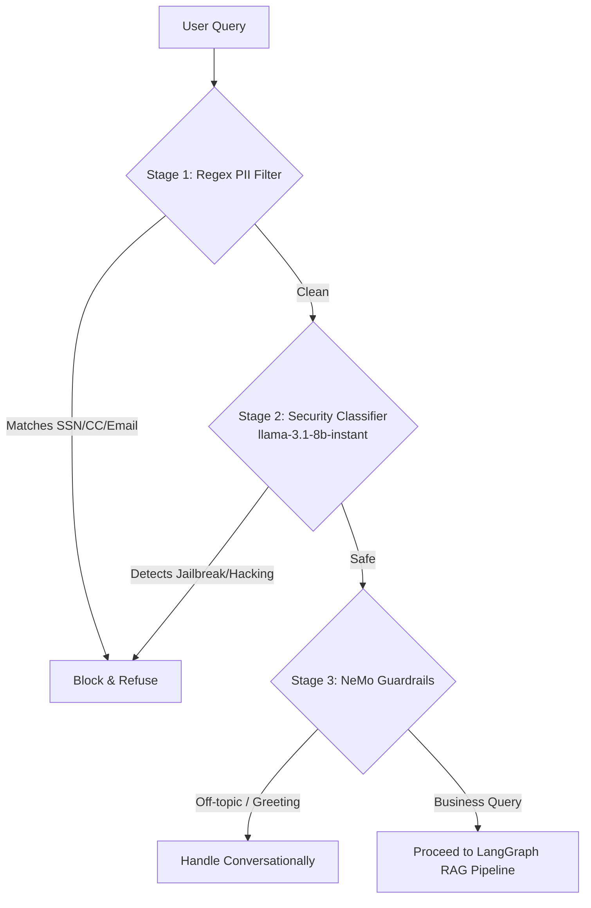

# Enterprise Agentic RAG System

An advanced, production-ready Retrieval-Augmented Generation (RAG) system built with agentic workflows. This system leverages state-of-the-art LLM routing, semantic reranking, and dynamic guardrails to ensure robust, enterprise-grade AI interactions.

## 🚀 Key Features & Architecture

- **Agentic Workflow (LangGraph)**: Utilises a state-machine driven agent architecture (Planner, Retriever, Responder nodes) to reason about queries and execute multi-step retrieval strategies.
- **LLM Gateway (Portkey AI)**: Centralised proxy for LLM requests providing intelligent routing, caching (Semantic mode), and automated fallback strategies (e.g., `llama-3.3-70b` falling back to `llama-3.1-8b`).
- **Security Guardrails (NVIDIA NeMo)**: Fast intent classification using Colang rules at the API gate to block off-topic queries and prevent prompt injections *before* hitting the RAG pipeline.
- **Vector Database (Qdrant)**: High-performance semantic search over enterprise knowledge.
- **Semantic Reranking (FlashRank)**: Local cross-encoder ONNX models re-score candidate chunks for ultra-high retrieval precision.
- **Observability (Logfire)**: Deep, distributed tracing across both the FastAPI backend and Streamlit frontend.

## 🛠️ Technology Stack

- **Frontend**: Streamlit
- **Backend API**: FastAPI, Uvicorn
- **Agent Framework**: LangChain & LangGraph
- **LLM Gateway**: Portkey AI
- **LLMs (via Gateway & Direct)**: Groq (`llama-3.3-70b-versatile`, `llama-3.1-8b-instant`)
- **Guardrails**: NeMo Guardrails
- **Embeddings**: `mixedbread-ai/mxbai-embed-large-v1` (via SentenceTransformers)
- **Vector Store**: Qdrant Cloud
- **Reranker**: FlashRank (`ms-marco-MiniLM-L-6-v2`)
- **Telemetry**: Pydantic Logfire

## ⚙️ Setup & Installation

### Prerequisites
- Python 3.11+
- `uv` (Recommended for fast dependency management)

### 1. Environment Variables
Create a `.env` file in the root directory containing your API keys and configuration:
```env
PORTKEY_API_KEY=your_portkey_key
GROQ_API_KEY=your_groq_key
GROQ_SLUG=your_portkey_virtual_key_slug
QDRANT_CLUSTER_ENDPOINT=your_qdrant_cluster_url
QDRANT_API_KEY=your_qdrant_api_key
LOGFIRE_TOKEN=your_logfire_token
BACKEND_URL=http://localhost:8000
```

### 2. Install Dependencies
```bash
uv pip install -r pyproject.toml
# Or simply sync if using a uv managed environment:
# uv sync
```

### 3. Data Ingestion
Before querying the system, ingest your enterprise documents into the Qdrant vector database:
```powershell
.\.venv\Scripts\python.exe -m app.ingestion.preprocessor
```

### 4. Running the Application
The application requires both the FastAPI backend and the Streamlit frontend to be running simultaneously.

**Terminal 1 (Backend):**
```powershell
.\.venv\Scripts\uvicorn.exe app.main:app --port 8000
```

**Terminal 2 (Frontend):**
```powershell
.\.venv\Scripts\streamlit.exe run ui/app.py
```

## 🛡️ Hybrid Guardrails Architecture

The system employs a rigorous 3-stage security gate before any query reaches the heavy LangGraph pipeline:



## 🏗️ Project Structure

- `app/agents/`: LangGraph definitions, states, and individual execution nodes (Planner, Retriever, Responder).
- `app/gateways/`: Portkey API client configuration for proxying LLM requests.
- `app/guardrails/`: NeMo Guardrails initialisation and `.co` definitions for intent filtering.
- `app/services/`: Qdrant vector search and FlashRank reranking services.
- `ui/`: Streamlit frontend application.
