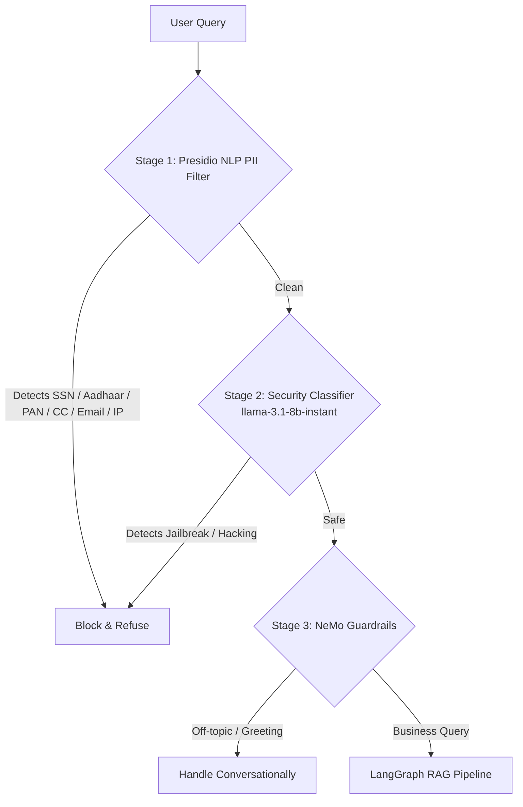
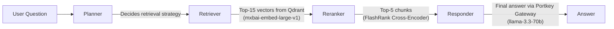

# 🏢 Enterprise Agentic RAG System

An advanced, production-ready Retrieval-Augmented Generation (RAG) system built with agentic workflows. This system leverages state-of-the-art LLM routing, NLP-based PII detection, semantic reranking, and dynamic guardrails to deliver robust, enterprise-grade AI interactions — all backed by a fully automated evaluation suite.

---

## 📊 Evaluation Results (Ragas-style LLM-as-Judge)

Evaluated against a golden dataset of 5 financial Q&A pairs generated from real enterprise PDFs (ACRES Capital 2022 Annual Report). Judged by `llama-3.3-70b-versatile` as the LLM evaluator.

| Metric | Score | Description |
|---|---|---|
| **Faithfulness** | **0.96 / 1.0** | Answers are grounded in retrieved context — no hallucinations |
| **Answer Relevancy** | **0.90 / 1.0** | Answers directly address the question |
| **Context Precision** | **0.92 / 1.0** | Retrieved chunks are highly relevant to the question |
| **Context Recall** | **0.60 / 1.0** | Most, but not all, needed information present in context |
| **Answer Correctness** | **0.96 / 1.0** | Final answers semantically match ground truth |

> The context recall of 0.60 reflects the inherent challenge of complex multi-fact financial questions where a single chunk may not contain all details. This can be improved by increasing `top_n` retrieval.

---

## 🚀 Key Features & Architecture

- **Agentic Workflow (LangGraph)**: State-machine driven agent with Planner, Retriever, and Responder nodes for multi-step reasoning over retrieved knowledge.
- **LLM Gateway (Portkey AI)**: Centralised proxy providing intelligent routing, semantic caching, and automated fallback (`llama-3.3-70b` → `llama-3.1-8b`).
- **NLP-Powered PII Guard (Microsoft Presidio)**: Stage 1 of the security pipeline uses Presidio's spaCy NLP engine to detect and block unstructured PII (SSNs, Aadhaar, PAN cards, credit cards, emails, IPs) — far beyond what regex alone can catch.
- **Security Classifier (LLM-based)**: Stage 2 uses `llama-3.1-8b-instant` to detect jailbreaks and harmful prompt injections before reaching the main pipeline.
- **Intent Guardrails (NVIDIA NeMo)**: Stage 3 uses Colang rules to manage conversational intent — handling greetings, off-topic queries, and routing genuine business questions.
- **Vector Database (Qdrant Cloud)**: High-performance semantic search over ingested enterprise knowledge.
- **Structure-Aware Chunking**: A recursive text splitter that respects paragraph, sentence, and clause boundaries — preserving financial figures and complete sentences across chunk boundaries.
- **Semantic Reranking (FlashRank)**: Local cross-encoder ONNX model (`ms-marco-MiniLM-L-6-v2`) re-scores candidate chunks for high retrieval precision without network latency.
- **Observability (Pydantic Logfire)**: Deep distributed tracing across both the FastAPI backend and Streamlit frontend.
- **Automated Evaluation Suite**: End-to-end evaluation pipeline (`scripts/evaluate_rag.py`) implementing 5 RAG-specific metrics using LLM-as-judge, completely independent of `pyarrow`/HuggingFace `datasets`.

---

## 🛡️ Hybrid Guardrails Architecture

A rigorous 3-stage security gate runs before any query reaches the LangGraph pipeline:



**What is blocked:**
- Financial identifiers: Credit card numbers, US SSNs, UK NINOs
- Indian IDs: Aadhaar numbers, PAN cards, Vehicle Registration numbers
- Network identifiers: IP addresses, personal email addresses, US passport numbers

**What is NOT blocked (by design):**
- Person names, Organisation names, Locations — so users can naturally query "Who is the CEO of X?"

---

## 🗺️ RAG Pipeline Flow



---

## 🛠️ Technology Stack

| Layer | Technology |
|---|---|
| **Frontend** | Streamlit |
| **Backend API** | FastAPI + Uvicorn |
| **Agent Framework** | LangChain & LangGraph |
| **LLM Gateway** | Portkey AI (caching + fallback) |
| **LLMs** | Groq (`llama-3.3-70b-versatile`, `llama-3.1-8b-instant`) |
| **PII Detection** | Microsoft Presidio + spaCy `en_core_web_lg` |
| **Intent Guardrails** | NVIDIA NeMo Guardrails |
| **Embeddings** | `mixedbread-ai/mxbai-embed-large-v1` (SentenceTransformers, CPU) |
| **Vector Store** | Qdrant Cloud |
| **Reranker** | FlashRank (`ms-marco-MiniLM-L-6-v2`) |
| **Telemetry** | Pydantic Logfire |
| **Evaluation** | Custom LLM-as-Judge (Groq `llama-3.3-70b`) |

---

## ⚙️ Setup & Installation

### Prerequisites
- Python 3.11+
- `uv` (recommended for fast dependency management)

### 1. Clone & Install Dependencies
```bash
git clone https://github.com/Pratyaksh-Singhal/Enterprise-RAG-System.git
cd Enterprise-RAG-System
uv sync
```

### 2. Environment Variables
Create a `.env` file in the root directory:
```env
PORTKEY_API_KEY=your_portkey_key
GROQ_API_KEY=your_groq_key
GROQ_SLUG=your_portkey_virtual_key_slug
QDRANT_CLUSTER_ENDPOINT=your_qdrant_cluster_url
QDRANT_API_KEY=your_qdrant_api_key
LOGFIRE_TOKEN=your_logfire_token
BACKEND_URL=http://localhost:8000
```

### 3. Download the spaCy NLP Model
Required for Presidio PII detection:
```bash
uv run python -m spacy download en_core_web_lg
```

### 4. Data Ingestion
Ingest your enterprise documents into Qdrant. Use `--wipe` to rebuild a fresh index:
```powershell
$env:CUDA_VISIBLE_DEVICES=""; .\.venv\Scripts\python.exe -m app.ingestion.preprocessor data --wipe
```

### 5. Running the Application

**Terminal 1 — Backend:**
```powershell
$env:CUDA_VISIBLE_DEVICES=""; .\.venv\Scripts\uvicorn.exe app.main:app --port 8000
```

**Terminal 2 — Frontend:**
```powershell
.\.venv\Scripts\streamlit.exe run ui/app.py
```

---

## 🧪 Evaluation

### Step 1: Generate Golden Dataset
Synthesises Q&A pairs from your ingested PDFs using Groq LLM:
```powershell
.\.venv\Scripts\python.exe scripts/generate_goldens.py
```
Output: `evaluation/goldens.json`

### Step 2: Run Evaluation
Runs your live RAG system against the golden dataset and scores it across 5 metrics:
```powershell
.\.venv\Scripts\python.exe scripts/evaluate_rag.py
```
Output: printed summary table + `evaluation/results.json`

---

## 🏗️ Project Structure

```
Enterprise_RAG/
├── app/
│   ├── agents/         # LangGraph state, nodes (Planner, Retriever, Responder), graph definition
│   ├── gateways/       # Portkey AI client for LLM proxying, caching & fallback
│   ├── guardrails/     # Presidio PII filter, Security Classifier, NeMo Colang rules
│   ├── ingestion/      # PDF loader, recursive chunker, Qdrant vectorisation pipeline
│   └── services/       # Qdrant vector search & FlashRank reranking services
├── scripts/
│   ├── generate_goldens.py   # Synthetic Q&A golden dataset generator
│   └── evaluate_rag.py       # LLM-as-judge RAG evaluation pipeline
├── evaluation/
│   ├── goldens.json    # Generated golden Q&A pairs
│   └── results.json    # Detailed per-question evaluation scores
├── data/               # Raw enterprise PDF documents (open source, from Kaggle)
├── ui/                 # Streamlit frontend application
└── pyproject.toml      # Project dependencies (managed by uv)
```
